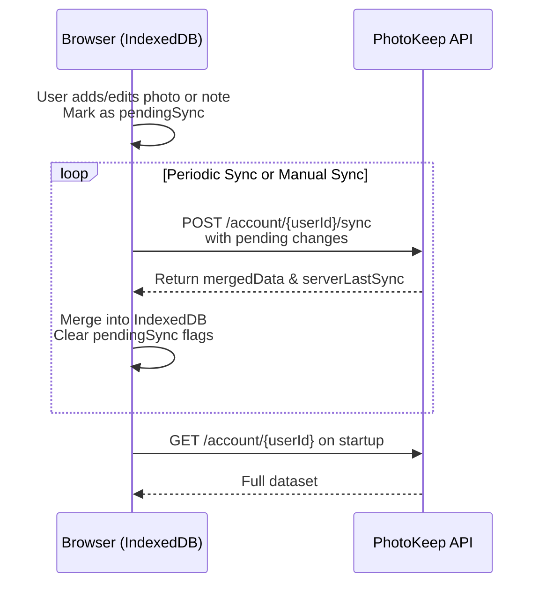

# Sync API Design Document

## Overview

The App Sync API allows clients (browsers, mobile apps, etc.) to:

- Retrieve all photo & note data for a given **User ID**
- Push local changes (new, updated, deleted items) to the server
- Keep local IndexedDB storage and remote cloud storage in sync
- Support offline-first workflow (store locally, sync when online)

---

## Guiding Principles

1. **Offline-first** — Local IndexedDB remains the primary store; API just syncs differences.
2. **Stateless** — Each request is independent; server doesn’t store session state.
3. **Minimal payloads** — Send only changed items in sync requests to reduce bandwidth.
4. **Idempotent updates** — Same request sent twice should not create duplicates.
5. **Conflict resolution** — Last-write-wins by default (can be extended later).

---

## Base URL

```
https://api.photokeep.com/v1
```

---

## Data Models

### Photo

```ts
{
  id: string;              // UUID generated on client
  createDate: number;      // Unix timestamp (ms)
  title: string;
  caption: string;
  tags: string[];
  fileName: string;        // without extension
  fileType: string;        // e.g., "jpg", "png"
}
```

### Note

```ts
{
  id: string; // UUID
  photoId: string; // FK to Photo.id
  text: string;
  timestamp: number; // Unix timestamp (ms)
}
```

---

## Endpoints

### 1. **GET /account/{userId}**

Retrieve all account data (photos + notes).

**Request**

```
GET /account/12345
Accept: application/json
```

**Response**

```json
{
  "userId": "12345",
  "lastSync": 1734132000000,
  "photos": [
    /* Photo[] */
  ],
  "notes": [
    /* Note[] */
  ]
}
```

---

### 2. **POST /account/{userId}/sync**

Push local changes (added/updated/deleted items) to the server.

**Request**

```json
{
  "clientLastSync": 1734132000000,
  "changes": {
    "photos": {
      "added": [
        {
          /* Photo */
        }
      ],
      "updated": [
        {
          /* Photo */
        }
      ],
      "deleted": ["photoId1", "photoId2"]
    },
    "notes": {
      "added": [
        {
          /* Note */
        }
      ],
      "updated": [
        {
          /* Note */
        }
      ],
      "deleted": ["noteId1"]
    }
  }
}
```

**Response**

```json
{
  "serverLastSync": 1734132050000,
  "conflicts": [
    {
      "type": "photo",
      "id": "photoId123",
      "serverVersion": {
        /* Photo */
      },
      "clientVersion": {
        /* Photo */
      }
    }
  ],
  "mergedData": {
    "photos": [
      /* updated photos array */
    ],
    "notes": [
      /* updated notes array */
    ]
  }
}
```

---

### 3. **POST /photos**

Upload a new photo binary and metadata.

**Request**

```
POST /photos
Content-Type: multipart/form-data
```

Form fields:

- `file`: binary image file
- `metadata`: JSON string with Photo object (without fileName/fileType — server fills in)

**Response**

```json
{
  "id": "uuid",
  "fileName": "uuid-generated",
  "fileType": "jpg",
  "createDate": 1734132100000
}
```

---

### 4. **DELETE /photos/{id}**

Delete a photo and its related notes.

**Response**

```json
{ "status": "ok" }
```

---

### 5. **DELETE /notes/{id}**

Delete a single note.

**Response**

```json
{ "status": "ok" }
```

---

## Sync Flow

1. **App startup**:
   - Load IndexedDB photos & notes
   - If online, call `GET /account/{userId}` and merge into local DB
2. **Local changes**:
   - Mark changed records in IndexedDB with a `pendingSync` flag
3. **Sync cycle** (manual or periodic):
   - Gather all `pendingSync` items
   - POST them to `/account/{userId}/sync`
   - Apply `mergedData` from response to local DB
   - Clear `pendingSync` flags

---

## Frontend Integration Notes

- **Offline support** — All actions work offline; API only used when connection is available.
- **Conflict resolution** — Initially, prefer server data if timestamps differ.
- **Upload flow** — For large files, photo metadata is stored locally immediately; binary upload happens in background.
- **Optimistic UI** — Show uploaded photo/note instantly, even before server confirms.

---

## Example Sync Request

```json
POST /account/12345/sync
{
  "clientLastSync": 1734132000000,
  "changes": {
    "photos": {
      "added": [
        {
          "id": "uuid-photo-1",
          "createDate": 1734131999000,
          "title": "New York Sunrise",
          "caption": "Skyline in the morning",
          "tags": ["city", "sunrise"],
          "fileName": "uuid-photo-1",
          "fileType": "jpg"
        }
      ],
      "updated": [],
      "deleted": []
    },
    "notes": { "added": [], "updated": [], "deleted": [] }
  }
}
```

---

## Sync Cycle Diagram


